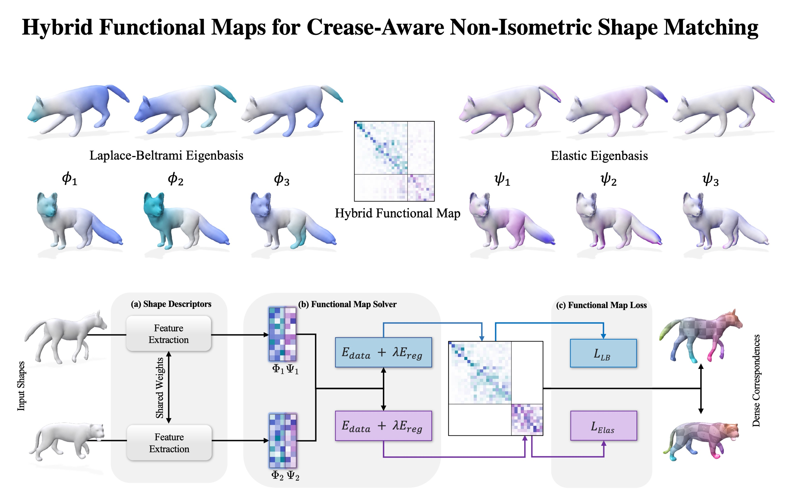

# [Hybrid Functional Maps for Crease-Aware Non-Isometric Shape Matching [CVPR 2024]](https://hybridfmaps.github.io)
<a href='https://hybridfmaps.github.io/'></a>  [](https://xieyizheng.com/media/papers/hybrid-functional-maps/hybrid_functional_maps_full.pdf)
[](https://arxiv.org/abs/2312.03678)



## Installation
```bash 
conda create -n hybridfmaps python=3.8 # create new virtual environment
conda activate hybridfmaps
conda install pytorch cudatoolkit -c pytorch # install pytorch
pip install -r requirements.txt # install other necessary libraries via pip
```
In addition, this code uses python bindings for an implementation of the Discrete Shell Energy. 

Please follow the installation instructions from: [Thin shell energy](https://gitlab.com/numod/shell-energy)

## Dataset
For training and testing datasets used in this paper, please refer to the [ULRSSM repository](https://github.com/dongliangcao/Unsupervised-Learning-of-Robust-Spectral-Shape-Matching/) from Dongliang Cao et al. Please follow the instructions there to download the necessary datasets and place them under `../data/`: 
```Shell
├── data
    ├── FAUST_r
    ├── FAUST_a
    ├── SCAPE_r
    ├── SCAPE_a
    ├── SHREC19_r
    ├── TOPKIDS
    ├── SMAL_r
    ├── DT4D_r
```
We thank the original dataset providers for their contributions to the shape analysis community, and that all credits should go to the the respective authors and contributors.

## Data preparation
For data preprocessing, we provide *[preprocess.py](preprocess.py)* to compute all things we need.
Here is an example for SMAL_r.
```python
python preprocess.py --data_root ../data/SMAL_r/ --no_normalize --n_eig 200
```

## Train
To train a specific model on a specified dataset.
```python
python train.py --opt options/hybrid_ulrssm/train/smal.yaml
```
You can visualize the training process in tensorboard or via wandb.
```bash
tensorboard --logdir experiments/
```

## Test
To test a specific model on a specified dataset.
```python
python test.py --opt options/hybrid_ulrssm/test/smal.yaml
```
The qualitative and quantitative results will be saved in [results](results) folder.

<!-- ## Texture Transfer
An example of texture transfer is provided in *[texture_transfer.py](texture_transfer.py)*
```python
python texture_transfer.py
``` -->

## Pretrained models
You can find all pre-trained models in [checkpoints](checkpoints) for reproducibility.

## Acknowledgement
The implementation of DiffusionNet is based on [the official implementation](https://github.com/nmwsharp/diffusion-net).

The implementation of Elastic Basis is adapted from [An Elastic Basis for Spectral Shape Correspondence](https://github.com/flrneha/ElasticBasisForSpectralMatching/).

The framework implementation is adapted from [Unsupervised Learning of Robust Spectral Shape Matching](https://github.com/dongliangcao/Unsupervised-Learning-of-Robust-Spectral-Shape-Matching/).

The GeomFmaps implementation follows [GeomFmaps-pytorch](https://github.com/pvnieo/GeomFmaps_pytorch/tree/master): A minimalist pytorch implementation of: "[Deep Geometric Functional Maps: Robust Feature Learning for Shape Correspondence](https://arxiv.org/pdf/2003.14286.pdf)".

We thank the original authors for their contributions to this code base.

<!-- : [Nickolas Sharp](https://github.com/nmwsharp/), [Florine Hartwig](https://github.com/flrneha) and [Dongliang Cao](https://github.com/dongliangcao), -->

## Attribution
Please cite our paper when using the code. You can use the following bibtex
```
@inproceedings{bastianxie2024hybrid,
  title={Hybrid Functional Maps for Crease-Aware Non-Isometric Shape Matching},
  author={Bastian, Lennart and Xie, Yizheng and Navab, Nassir and L{\"a}hner, Zorah},
  booktitle={Proceedings of the IEEE/CVF Conference on Computer Vision and Pattern Recognition (CVPR)},
  year={2024},
  note={Accepted for publication}
}

```